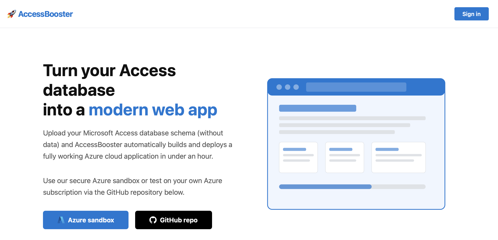

Follow these steps to run the agent (images for steps are in readme_images)

1. Fork this repo and make your fork private (Settings > Danger Zone > Leave fork network. Then Visibility > Private)
2. Download the powershell script (extract_schema.ps1) to run locally against your Access Database so your data is protected and only the schema files get uploaded
3. Upload the output into access_objects
4. Run the AccessBooster custom agent, asking it to "modernise my access database"
5. Wait til agent is done (10-20 minutes)
6. Accept and merge the code to 'main' branch
7. Open main branch in new Codespace
8. In terminal run 'az login' to set the Azure sandbox tenant
9. Then run bash scripts/deploy.sh
10. Optionally set the location / subscription with scripts/deploy.sh [--location westus2] [--subscription <id>]

For help just ask your Microsoft account team for an AccessBooster workshop and an AI Apps Solution Engineer will walk you through all these steps on a Teams call.

You can also use a Microsoft sandbox in our self-serve interface here: https://msaccessboost.com
